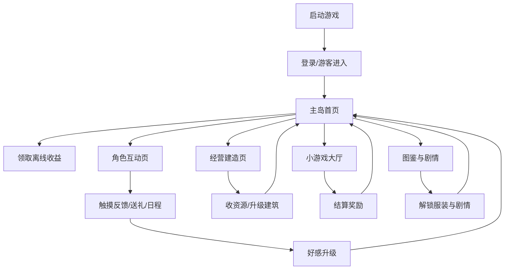

# 《蔚蓝海湾》GDD（MVP可交付版）

## 0. 文档信息
- 项目代号：`AzureBay`
- 文档版本：`v1.0`
- 更新时间：`2026-03-03`
- 平台：`iOS / Android（竖屏）`
- 引擎：`Unity 2022 LTS + Live2D Cubism SDK`
- 项目定位：治愈系 Live2D 海岛休闲互动游戏（独立项目，不与萌虾牧场数据互通）

## 1. 产品目标
- 30 秒上手，3 分钟获得正反馈。
- 单日 10-20 分钟轻度游玩，不制造焦虑。
- 以角色互动和情感养成为第一核心，经营与收集为第二核心。

## 2. 目标用户与体验目标
- 用户画像：16-35 岁，偏好治愈、轻养成、纸片人互动。
- 体验关键词：放松、陪伴、轻目标、可持续解锁。
- KPI 目标（MVP）：
  - D1 >= 40%
  - D7 >= 18%
  - 平均会话时长 >= 8 分钟
  - 新手 10 分钟内完成首次好感升级 >= 80%

## 3. MVP范围（12周）
- 角色：5 位（汐、柠、星、帆、月）
- 场景：海滩、果园、书屋、码头、灯塔
- 玩法：
  - 角色互动（触摸反馈+情绪+好感）
  - 海岛轻经营（建设+离线产出）
  - 4 个小游戏（钓鱼/采摘/拼图/节拍）
  - 图鉴系统（服装/道具/剧情/成就）
- 社交：好友互访、点赞、留言（弱社交）

## 4. 核心循环
1. 上线领取离线资源与角色留言。
2. 互动（触摸/送礼/日程）提升好感。
3. 经营（收菜/建造/升级）获取资源。
4. 小游戏补充资源与活动积分。
5. 解锁剧情、服装、场景装饰。
6. 下线前布置次日目标。

## 5. 系统设计（含数值）

### 5.1 角色属性与好感
- 好感等级：`1-20`
- 等级经验：`expNeed = 80 + level*35`
- 情绪值：`0-100`（开心/平静/疲惫/生气）
- 日常衰减：每 2 小时 -4（最低到 35）
- 互动收益（基础值）：
  - 摸头：+8 好感，情绪 +3，冷却 30 秒
  - 牵手：+12 好感，情绪 +5，冷却 90 秒
  - 送礼：+20~60 好感（按喜好加成）
  - 日程事件：+35 好感，触发剧情点 +1

### 5.2 经济系统
- 货币：
  - 贝壳（软通货）
  - 海星（活动/成就通货）
- 日常产出（每小时）：
  - 果园 Lv1：30 贝壳
  - 渔场 Lv1：42 贝壳
  - 工坊 Lv1：18 贝壳 + 材料 1
- 建筑升级成本（示例）：
  - Lv1->2：500 贝壳 + 木材 6
  - Lv2->3：1200 贝壳 + 木材 12 + 玻璃 4

### 5.3 离线收益
- 离线时长上限：8 小时
- 离线收益：`在线基础产出的 70%`
- 月卡加成：离线上限 +4 小时，收益倍率 x1.2

### 5.4 小游戏奖励
- 钓鱼：60-180 秒局，基础 40 贝壳，稀有鱼额外 +1 海星
- 采摘：90 秒局，按连击结算，最高 140 贝壳
- 拼图：每日 3 次，首次通关给剧情碎片
- 节拍：评级 C/B/A/S 奖励 20/35/55/90 贝壳

### 5.5 图鉴与收集
- 服装图鉴：每角色 4 套（MVP 共 20 套）
- 剧情图鉴：每角色 3 章，章节内 5 段
- 成就图鉴：40 条（签到、互动、收集、小游戏）

## 6. 界面与流程图

### 6.1 主流程图（Mermaid）

### 6.2 页面清单
| 页面ID | 页面名 | 核心功能 | 关键CTA |
|---|---|---|---|
| P01 | 启动页 | 登录、公告、版本信息 | 开始游戏 |
| P02 | 主岛首页 | 资源总览、入口导航 | 去互动/去经营 |
| P03 | 角色互动 | Live2D触摸、表情、送礼 | 互动、送礼 |
| P04 | 经营建造 | 建造、升级、收菜 | 升级建筑 |
| P05 | 小游戏大厅 | 四玩法入口 | 开始挑战 |
| P06 | 图鉴中心 | 服装/剧情/成就查看 | 前往解锁 |
| P07 | 好友互访 | 点赞、留言、送礼 | 访问好友 |
| P08 | 商店 | 月卡/外观/礼包 | 购买 |

## 7. Live2D实现规范

### 7.1 模型参数标准
- 必备参数：`ParamAngleX/Y/Z`, `ParamBodyAngleX`, `ParamEyeLOpen`, `ParamEyeROpen`, `ParamMouthOpenY`
- 情绪参数：`ParamEmotion_Happy/Shy/Tired/Angry`
- 互动参数：`ParamTouch_Head`, `ParamTouch_Hand`, `ParamTouch_Shoulder`

### 7.2 动作包规范
- 每角色最低动作：
  - 待机 x3
  - 互动 x6
  - 场景动作 x4
  - 剧情动作 x3
- 命名规范：`char_<name>_<category>_<index>`

### 7.3 性能预算
- 单角色模型包：`<= 50MB`
- 同屏 Live2D：最多 2 角色
- 低端机自动降级：
  - 阴影关闭
  - 物理采样减半
  - 目标帧率 30fps

## 8. 技术架构
- 客户端模块：
  - `Core`（状态机、事件总线、存档）
  - `Live2D`（模型加载、参数驱动、触摸反馈）
  - `Gameplay`（经营/小游戏/图鉴）
  - `UI`（页面路由、弹窗、动效）
  - `Data`（本地配置表 + 远程热更）
- 数据存储：
  - 本地：用户设置、离线缓存、资源快照
  - 服务端：账号、付费、活动、排行榜、社交

## 9. 任务拆解（12周）
| 周次 | 目标 | 交付物 |
|---|---|---|
| 1-2 | 需求冻结与原型 | PRD/GDD/低保真流程 |
| 3-4 | Live2D基础与互动框架 | 2名角色可互动Demo |
| 5-6 | 经营系统与离线收益 | 建造/产出/升级闭环 |
| 7-8 | 小游戏四件套 | 可结算与奖励接入 |
| 9-10 | 图鉴/剧情/成就 | 长线目标系统可用 |
| 11 | 性能优化与兼容测试 | 中低端机稳定运行 |
| 12 | 联调与提审 | iOS/Android 提审包 |

## 10. 资源清单（MVP）
| 类别 | 数量 | 说明 |
|---|---:|---|
| Live2D角色 | 5 | 每角色含基础动作包 |
| 场景背景 | 12 | 昼夜+天气变体 |
| UI图标 | 180 | 功能、货币、状态 |
| 服装立绘 | 20 | 每角色4套 |
| 音乐BGM | 10 | 场景与玩法主题 |
| 音效SFX | 120 | 触摸、UI、环境、结算 |
| 剧情文本 | 15章 | 每角色3章 |

## 11. 商业化与公平性
- 仅做温和变现：
  - 月卡
  - 外观礼包
  - 自愿激励广告
- 限制原则：
  - 不卖战力
  - 不锁核心剧情
  - 不做强迫广告

## 12. 风险与预案
| 风险 | 影响 | 预案 |
|---|---|---|
| Live2D产能不足 | 版本延期 | 先上3角色，2角色版本后补 |
| 玩法疲劳 | 留存下降 | 周活动+随机事件+短剧情 |
| 性能不稳 | 机型差评 | 分级渲染+素材压缩+热修 |
| 内容消耗快 | 中后期流失 | 月更角色服装与剧情支线 |

## 13. 验收标准（MVP）
- 10 分钟完整体验闭环可跑通。
- 5 位角色互动反馈均可触发且无阻断。
- 经营/小游戏/图鉴三系统数据互通。
- 中端安卓机（近3年主流）稳定 45-60fps。
- 无 P0/P1 阻断型 bug 后进入上线流程。

## 14. 附录：首版配置建议
- 新手七日目标：
  - Day1：完成首次互动与建造
  - Day2：解锁小游戏大厅
  - Day3：首次服装解锁
  - Day4：首次剧情章节
  - Day5：好友互访
  - Day6：图鉴完成度 20%
  - Day7：好感等级达到 5

